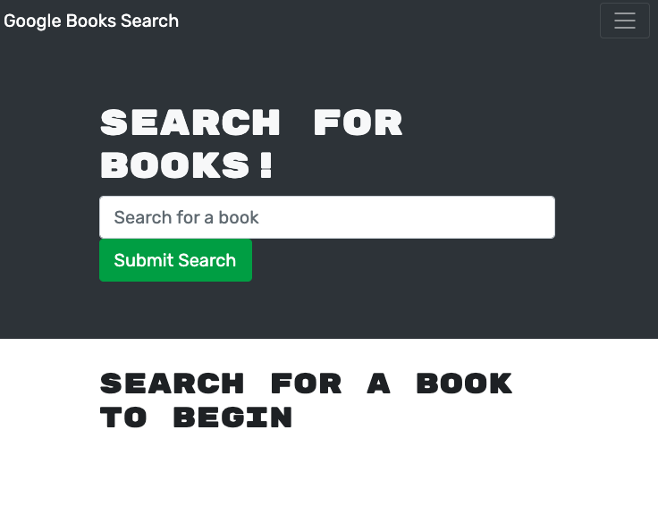

# book-search-restful-to-graphql

## Description 
A refactoring project taking a restful api and turining it into a GraphQL api built with Apollo Server

## Table of Contents
* [Installation](#installation)
* [Usage](#usage)
* [Built With](#built-with)
* [Questions](#questions)

## Installation
~~~
npm i
~~~
## Usage

Visit the project here: https://pure-reaches-90583.herokuapp.com/

## Built With
* MERN stack
* Mongoose and Apollo to work with database 
* Initial Code: https://github.com/coding-boot-camp/solid-broccoli

## Questions

Contact me at madalyne@madalynecross.com with any questions. View more of my work here: [violanerd](https://github.com/violanerd).